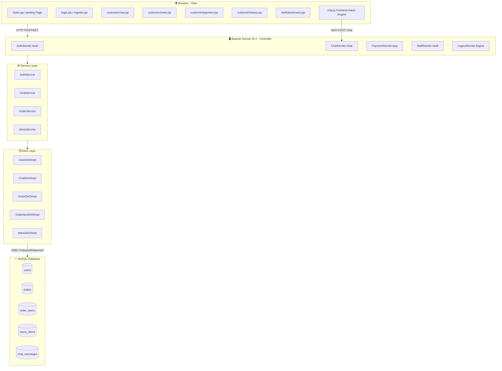
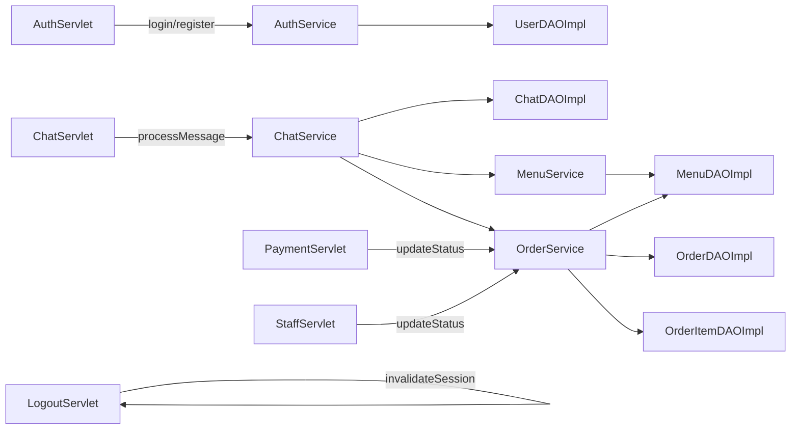
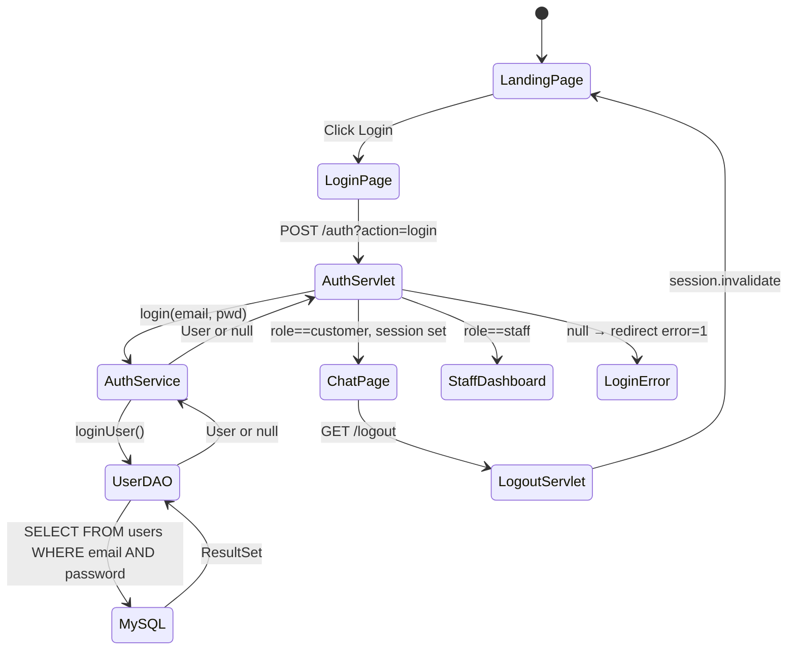

# PlateUp Restaurant Chatbot — Architecture Documentation

> **Stack:** Jakarta EE 5.0 · Java 24 · Apache Tomcat 10.1 · MySQL 8.0 · HTML/CSS/JS (Vanilla)
> **Pattern:** MVC (Model-View-Controller) with DAO-Service layering

---

## 1. High-Level Architecture



---

## 2. MVC Layer Responsibilities

| Layer | Package | Responsibility |
|-------|---------|----------------|
| **View** | `src/main/webapp/` | JSP pages render UI using session attributes; `chat.js` handles frontend intent detection |
| **Controller** | `com.ai.restaurant.controller` | Servlets receive HTTP requests, delegate to Services, redirect/respond |
| **Service** | `com.ai.restaurant.service` | Business logic — validation, orchestration, GST calculation (18%) |
| **DAO** | `com.ai.restaurant.dao` | Data access — all SQL via `PreparedStatement`, returns model objects |
| **Model** | `com.ai.restaurant.model` | Pure POJOs — `User`, `Order`, `OrderItem`, `MenuItem`, `ChatMessage` |
| **Util** | `com.ai.restaurant.util` | `DBConnection` — single-point JDBC connection factory |

---

## 3. Complete File Structure

```
Restaurant_Chatbot/src/main/
├── java/com/ai/restaurant/
│   ├── controller/
│   │   ├── AuthServlet.java        @WebServlet("/auth")
│   │   ├── ChatServlet.java        @WebServlet("/chat")
│   │   ├── LogoutServlet.java      @WebServlet("/logout")
│   │   ├── PaymentServlet.java     @WebServlet("/pay")
│   │   └── StaffServlet.java       @WebServlet("/staff")
│   ├── dao/
│   │   ├── ChatDAO.java / ChatDAOImpl.java
│   │   ├── MenuDAO.java / MenuDAOImpl.java
│   │   ├── OrderDAO.java / OrderDAOImpl.java
│   │   ├── OrderItemDAO.java / OrderItemDAOImpl.java
│   │   └── UserDAO.java / UserDAOImpl.java
│   ├── model/
│   │   ├── User.java
│   │   ├── Order.java
│   │   ├── OrderItem.java
│   │   ├── MenuItem.java
│   │   └── ChatMessage.java
│   ├── service/
│   │   ├── AuthService.java
│   │   ├── ChatService.java
│   │   ├── MenuService.java
│   │   └── OrderService.java
│   └── util/
│       └── DBConnection.java
└── webapp/
    ├── index.jsp               Landing page (PlateUp)
    ├── login.jsp / register.jsp
    ├── customer/
    │   ├── chat.jsp            AI Chatbot UI
    │   ├── order.jsp           Current order + status tracker
    │   ├── payment.jsp         QR scan and pay
    │   └── history.jsp         Past orders
    ├── staff/
    │   └── dashboard.jsp
    ├── assets/
    │   ├── css/ theme.css · style.css · chat.css
    │   ├── js/  theme.js · chat.js
    │   └── images/menu/ (16 food PNGs)
    └── WEB-INF/lib/
        ├── mysql-connector-j-8.3.0.jar
        └── json-20240303.jar
```

---

## 4. Controller → Service → DAO Call Map



---

## 5. Authentication State Flow


