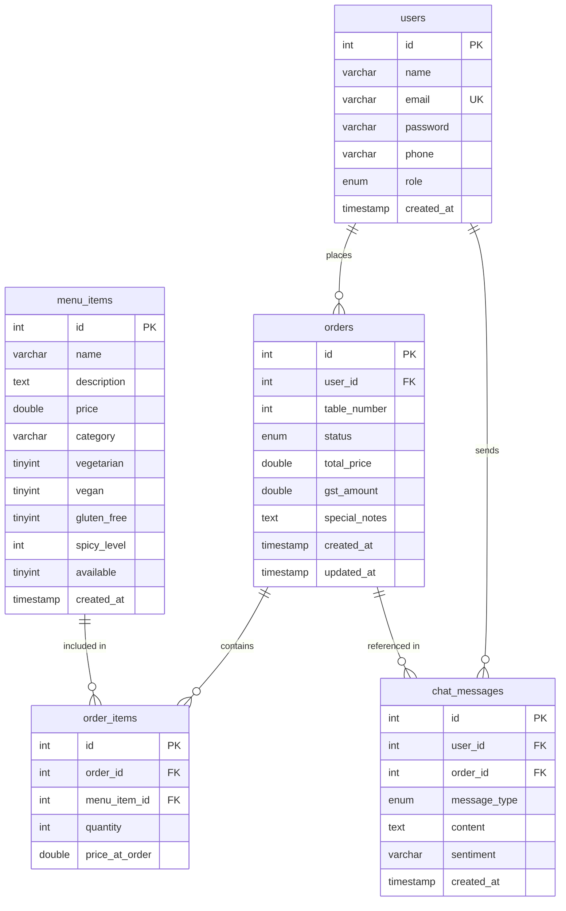
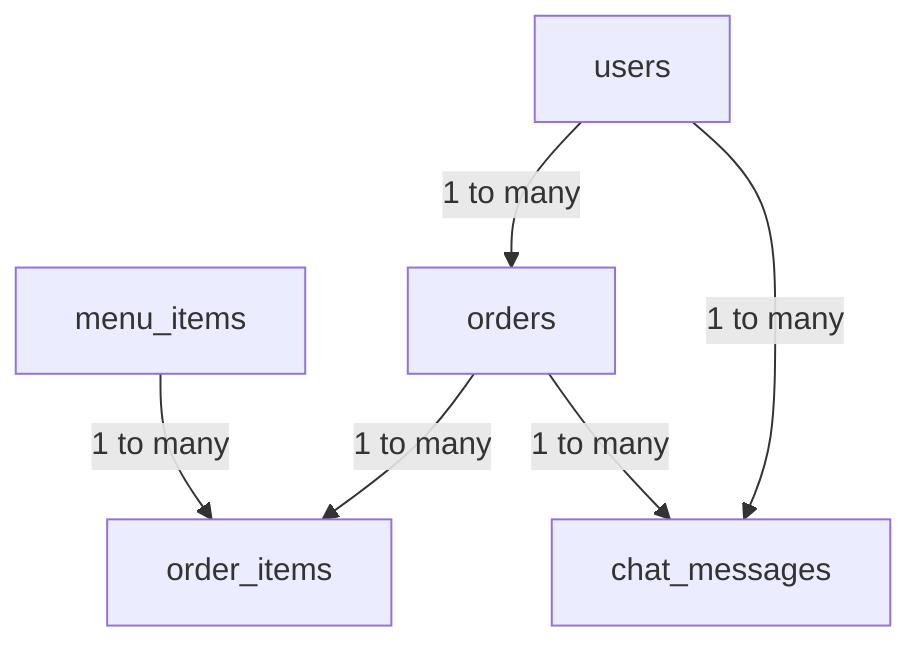

# PlateUp Restaurant Chatbot — Database Documentation

> **DBMS:** MySQL 8.0 · **Database:** `ai_restaurant_chatbot`
> **Connection:** `DBConnection.java` via `com.mysql.cj.jdbc.Driver`

---

## 1. Entity-Relationship Diagram

---

## 2. Table Details

### `users`
Stores all registered users (customers and staff).

| Column | Type | Constraints | Notes |
|--------|------|-------------|-------|
| `id` | INT | PK, AUTO_INCREMENT | Surrogate key |
| `name` | VARCHAR(100) | NOT NULL | Display name |
| `email` | VARCHAR(150) | NOT NULL, UNIQUE | Login identifier |
| `password` | VARCHAR(255) | NOT NULL | Plaintext (⚠️ upgrade to BCrypt) |
| `phone` | VARCHAR(15) | | Optional contact |
| `role` | ENUM | DEFAULT 'customer' | `customer` or `staff` |
| `created_at` | TIMESTAMP | DEFAULT NOW() | Auto-set on insert |

**Java Class:** `com.ai.restaurant.model.User`
**DAO:** `UserDAO` / `UserDAOImpl`

---

### `orders`
Represents a customer's order session.

| Column | Type | Constraints | Notes |
|--------|------|-------------|-------|
| `id` | INT | PK, AUTO_INCREMENT | |
| `user_id` | INT | FK → users.id, NULLABLE | NULL = walk-in guest |
| `table_number` | INT | NOT NULL | Default 1 for chatbot orders |
| `status` | ENUM | NOT NULL | `pending` → `preparing` → `ready` → `served` |
| `total_price` | DOUBLE | | Subtotal + GST (18%) |
| `gst_amount` | DOUBLE | | `subtotal × 0.18` |
| `special_notes` | TEXT | | "Placed via chatbot" etc. |
| `created_at` | TIMESTAMP | DEFAULT NOW() | |
| `updated_at` | TIMESTAMP | ON UPDATE NOW() | |

**Java Class:** `com.ai.restaurant.model.Order`
**DAO:** `OrderDAO` / `OrderDAOImpl`

---

### `order_items`
Junction table linking each order to menu items ordered.

| Column | Type | Constraints | Notes |
|--------|------|-------------|-------|
| `id` | INT | PK, AUTO_INCREMENT | |
| `order_id` | INT | FK → orders.id | Cascade delete |
| `menu_item_id` | INT | FK → menu_items.id | |
| `quantity` | INT | NOT NULL | Min 1 |
| `price_at_order` | DOUBLE | NOT NULL | Snapshot of price at time of order |

**Java Class:** `com.ai.restaurant.model.OrderItem`
**DAO:** `OrderItemDAO` / `OrderItemDAOImpl`

> **Design note:** `price_at_order` snapshots the price so future price changes don't alter historical orders.

---

### `menu_items`
The restaurant's full catalogue — 30 items seeded.

| Column | Type | Constraints | Notes |
|--------|------|-------------|-------|
| `id` | INT | PK, AUTO_INCREMENT | |
| `name` | VARCHAR(150) | NOT NULL | Used for fuzzy-match by ChatService |
| `description` | TEXT | | Shown in UI cards |
| `price` | DOUBLE | NOT NULL | In INR |
| `category` | VARCHAR(50) | | `Starter`, `Main Course`, `Bread`, `Dessert`, `Beverage` |
| `vegetarian` | TINYINT(1) | DEFAULT 0 | 1 = veg |
| `vegan` | TINYINT(1) | DEFAULT 0 | |
| `gluten_free` | TINYINT(1) | DEFAULT 0 | |
| `spicy_level` | INT | DEFAULT 0 | 0–5 scale |
| `available` | TINYINT(1) | DEFAULT 1 | Soft toggle |
| `created_at` | TIMESTAMP | DEFAULT NOW() | |

**Java Class:** `com.ai.restaurant.model.MenuItem`
**DAO:** `MenuDAO` / `MenuDAOImpl`

---

### `chat_messages`
Audit log of every user message and bot reply.

| Column | Type | Constraints | Notes |
|--------|------|-------------|-------|
| `id` | INT | PK, AUTO_INCREMENT | |
| `user_id` | INT | FK → users.id | |
| `order_id` | INT | FK → orders.id, NULLABLE | Set when message triggers order |
| `message_type` | ENUM | NOT NULL | `user` or `assistant` |
| `content` | TEXT | NOT NULL | Raw message text |
| `sentiment` | VARCHAR(20) | DEFAULT 'neutral' | Future NLP hook |
| `created_at` | TIMESTAMP | DEFAULT NOW() | |

**Java Class:** `com.ai.restaurant.model.ChatMessage`
**DAO:** `ChatDAO` / `ChatDAOImpl`

---

## 3. Table Relationships Summary

| Relationship | Type | Description |
|---|---|---|
| `users` → `orders` | One-to-Many | A user can have multiple orders; each order belongs to one user |
| `orders` → `order_items` | One-to-Many | Each order has multiple line items |
| `menu_items` → `order_items` | One-to-Many | A menu item can appear in many order line items |
| `users` → `chat_messages` | One-to-Many | Every chatbot message is tied to a user |
| `orders` → `chat_messages` | One-to-Many (optional) | Messages may reference an active order |

---

## 4. Java Model ↔ Table Mapping

| Java Class | DB Table | Key Fields Mapped |
|---|---|---|
| `User` | `users` | id, name, email, password, phone, role, createdAt |
| `Order` | `orders` | id, userId, tableNumber, status, totalPrice, gstAmount, specialNotes |
| `OrderItem` | `order_items` | id, orderId, menuItemId, quantity, priceAtOrder |
| `MenuItem` | `menu_items` | id, name, description, price, category, vegetarian, vegan, glutenFree, spicyLevel, available |
| `ChatMessage` | `chat_messages` | id, userId, orderId, messageType, content, sentiment |

---

## 5. Seeded Menu Data (30 Items)

| # | Name | Category | Veg | Price (₹) |
|---|------|----------|-----|-----------|
| 1 | Paneer Tikka | Starter | ✅ | 280 |
| 2 | Dal Makhani | Main Course | ✅ | 220 |
| 3 | Veg Biryani | Main Course | ✅ | 260 |
| 4 | Palak Paneer | Main Course | ✅ | 240 |
| 5 | Aloo Paratha | Bread | ✅ | 160 |
| 6 | Mushroom Masala | Main Course | ✅ | 230 |
| 7 | Chana Masala | Main Course | ✅ | 200 |
| 8 | Gulab Jamun | Dessert | ✅ | 120 |
| 9 | Butter Chicken | Main Course | ❌ | 340 |
| 10 | Mutton Rogan Josh | Main Course | ❌ | 420 |
| 11 | Chicken Biryani | Main Course | ❌ | 320 |
| 12 | Fish Curry | Main Course | ❌ | 360 |
| 13 | Chicken Tikka | Starter | ❌ | 300 |
| 14 | Mutton Keema | Main Course | ❌ | 380 |
| 15 | Prawn Masala | Main Course | ❌ | 440 |
| 16 | Egg Curry | Main Course | ❌ | 200 |
| 17 | Butter Naan | Bread | ✅ | 60 |
| 18 | Garlic Naan | Bread | ✅ | 70 |
| 19 | Tandoori Roti | Bread | ✅ | 40 |
| 20 | Chicken Wings | Starter | ❌ | 220 |
| 21 | Mango Lassi | Beverage | ✅ | 90 |
| 22 | Cold Coffee | Beverage | ✅ | 120 |
| 23 | Masala Chai | Beverage | ✅ | 60 |
| 24 | Chocolate Brownie | Dessert | ✅ | 150 |
| 25 | Rasgulla | Dessert | ✅ | 100 |
| 26 | Samosa | Starter | ✅ | 80 |
| 27 | Pav Bhaji | Main Course | ✅ | 160 |
| 28 | Veg Manchurian | Starter | ✅ | 200 |
| 29 | Chicken Soup | Starter | ❌ | 160 |
| 30 | Chole Bhature | Main Course | ✅ | 220 |
