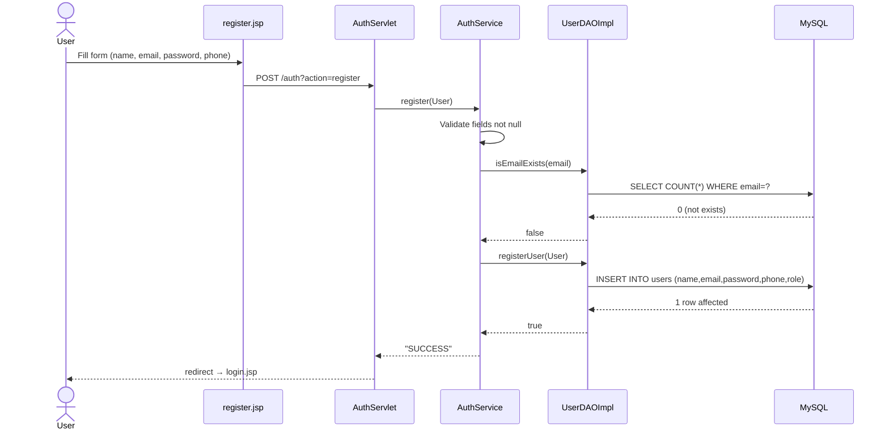
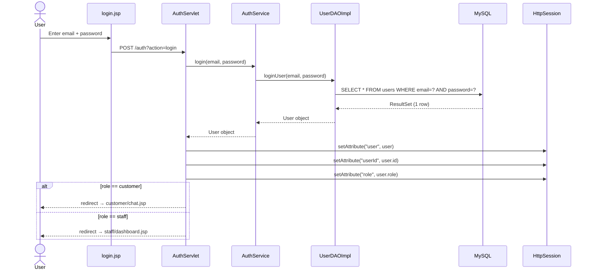
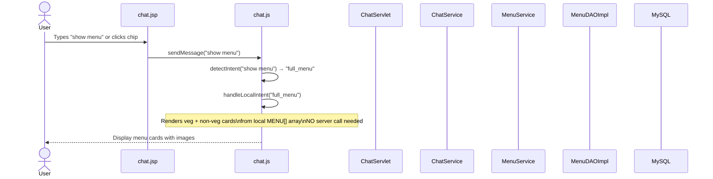
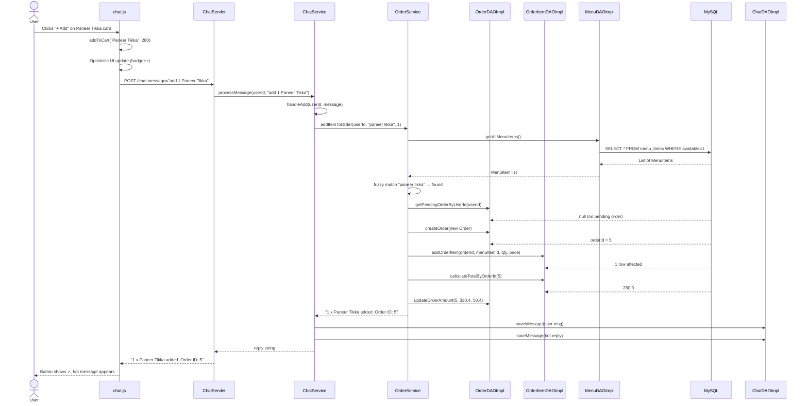
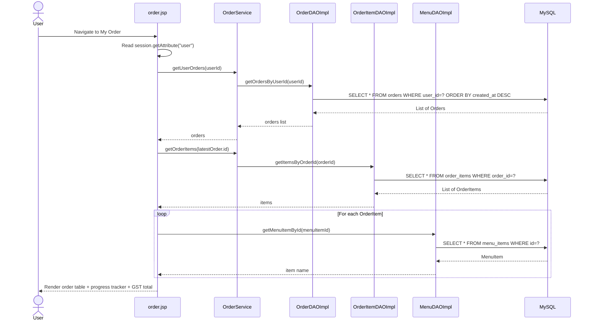
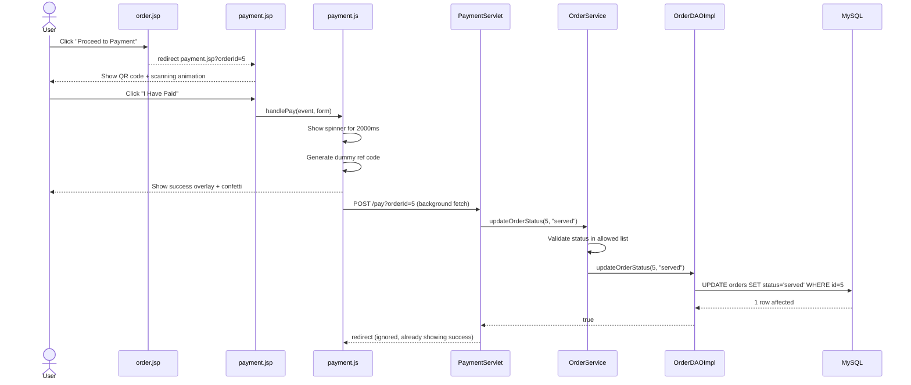
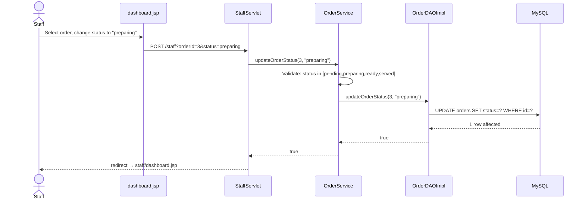
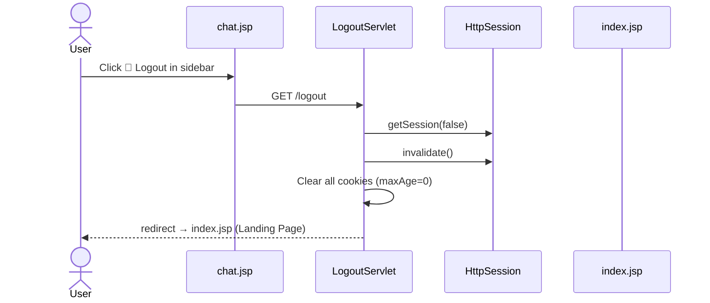

# PlateUp Restaurant Chatbot — Sequence Diagrams

> Each diagram below shows a complete end-to-end flow for a key user interaction.

---

## 1. User Registration Flow

---

## 2. User Login Flow

---

## 3. Chatbot — Show Menu Flow

> **Design note:** The frontend `chat.js` has a local `MENU[]` array for all 16 display items, so "show menu", "veg", "non-veg" are handled entirely client-side — zero server latency.

---

## 4. Chatbot — Add Item to Order Flow

---

## 5. View Order Flow

---

## 6. Payment Flow

---

## 7. Staff — Update Order Status Flow

---

## 8. Logout Flow

