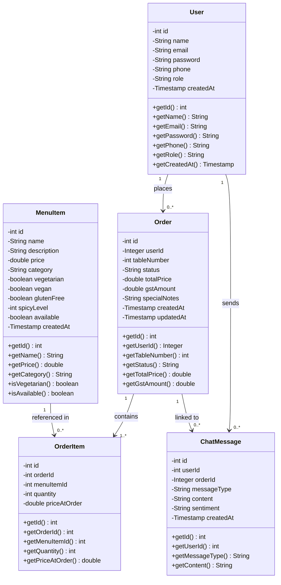
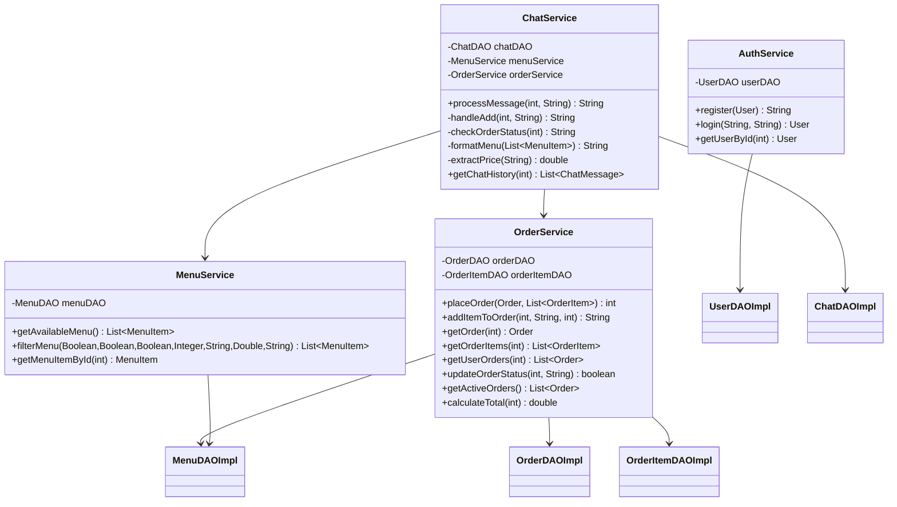
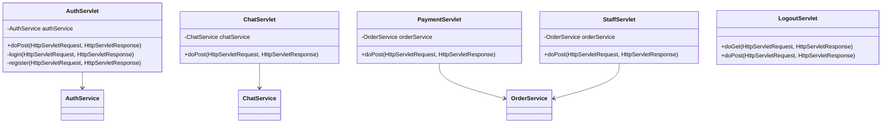
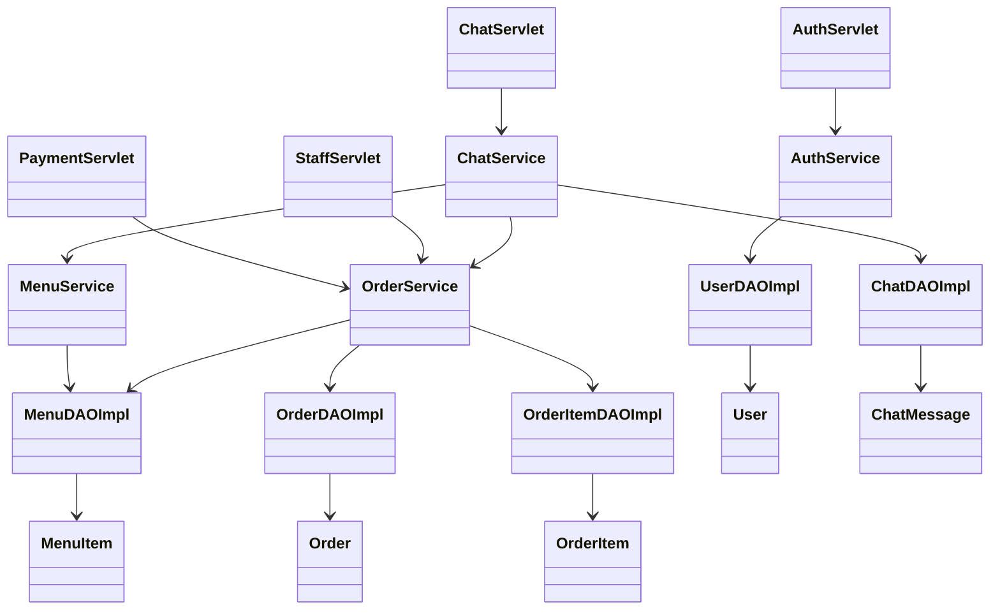

# PlateUp Restaurant Chatbot — Class Diagrams

---

## 1. Model Layer — All Entities

---

## 2. DAO Layer — Interfaces and Implementations

```mermaid
classDiagram
    class UserDAO {
        <<interface>>
        +registerUser(User) boolean
        +loginUser(String, String) User
        +getUserById(int) User
        +isEmailExists(String) boolean
        +getAllUsers() List~User~
        +updateUser(User) boolean
        +deleteUser(int) boolean
    }

    class UserDAOImpl {
        +registerUser(User) boolean
        +loginUser(String, String) User
        +getUserById(int) User
        +isEmailExists(String) boolean
        +getAllUsers() List~User~
        -extractUser(ResultSet) User
    }

    class OrderDAO {
        <<interface>>
        +createOrder(Order) int
        +getOrderById(int) Order
        +getOrdersByUserId(int) List~Order~
        +getPendingOrderByUserId(int) Order
        +updateOrderStatus(int, String) boolean
        +updateOrderAmount(int, double, double) boolean
        +getActiveOrders() List~Order~
    }

    class OrderDAOImpl {
        +createOrder(Order) int
        +getOrderById(int) Order
        +getOrdersByUserId(int) List~Order~
        +getPendingOrderByUserId(int) Order
        +updateOrderStatus(int, String) boolean
        +updateOrderAmount(int, double, double) boolean
        +getActiveOrders() List~Order~
        -extractOrder(ResultSet) Order
    }

    class OrderItemDAO {
        <<interface>>
        +addOrderItem(OrderItem) boolean
        +addMultipleItems(List~OrderItem~) boolean
        +getItemsByOrderId(int) List~OrderItem~
        +calculateTotalByOrderId(int) double
    }

    class OrderItemDAOImpl {
        +addOrderItem(OrderItem) boolean
        +addMultipleItems(List~OrderItem~) boolean
        +getItemsByOrderId(int) List~OrderItem~
        +calculateTotalByOrderId(int) double
    }

    class MenuDAO {
        <<interface>>
        +getAllMenuItems() List~MenuItem~
        +getAvailableMenuItems() List~MenuItem~
        +getMenuItemById(int) MenuItem
        +getMenuItemByName(String) MenuItem
        +filterMenu(Boolean, Boolean, Boolean, Integer, String, Double, String) List~MenuItem~
    }

    class MenuDAOImpl {
        +getAllMenuItems() List~MenuItem~
        +getAvailableMenuItems() List~MenuItem~
        +getMenuItemById(int) MenuItem
        +getMenuItemByName(String) MenuItem
        +filterMenu(...) List~MenuItem~
        -extractMenuItem(ResultSet) MenuItem
    }

    class ChatDAO {
        <<interface>>
        +saveMessage(ChatMessage) boolean
        +getMessagesByUserId(int) List~ChatMessage~
    }

    class ChatDAOImpl {
        +saveMessage(ChatMessage) boolean
        +getMessagesByUserId(int) List~ChatMessage~
    }

    UserDAO <|.. UserDAOImpl
    OrderDAO <|.. OrderDAOImpl
    OrderItemDAO <|.. OrderItemDAOImpl
    MenuDAO <|.. MenuDAOImpl
    ChatDAO <|.. ChatDAOImpl
```

---

## 3. Service Layer

---

## 4. Controller Layer

---

## 5. Full System Class Diagram (Simplified)

